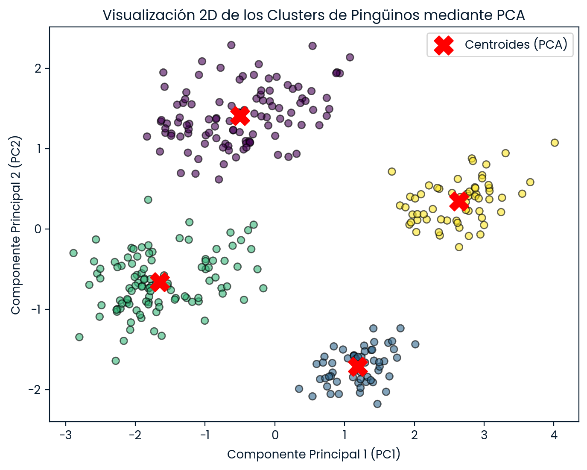
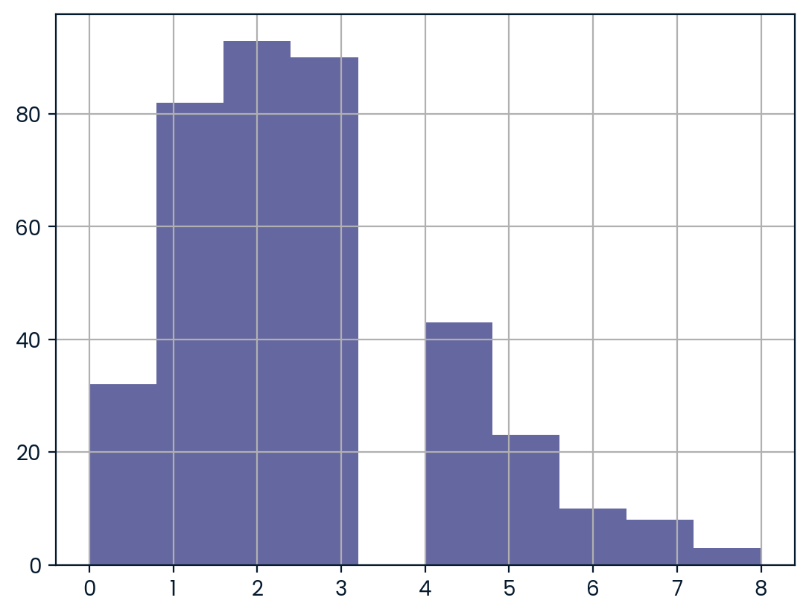

<!-- Encabezado Estilo "Hi, I'm Hannah" (Lado a Lado) -->
<table border="0">
  <tr>
    <td width="65%" valign="middle">
      <h1>¡Hola!, Soy Max 👋</h1>
      <h3>Data Scientist | Machine Learning & AI Specialist</h3>
      

        ¡Te doy la bienvenida a mi portafolio de Ciencia de Datos e Inteligencia Artificial! 
        Aquí encontrarás proyectos donde transformo datos complejos en modelos predictivos, 
        análisis estadísticos y soluciones accionables, combinando el rigor del método científico con la tecnología.
      

       
      <!-- Botones de contacto con estilo hueso -->
      <a href="https://<!-- Encabezado Estilo "Hi, I'm Hannah" (Lado a Lado) -->
<table border="0">
  <tr>
    <td width="65%" valign="middle">
      <h1>Hi, I'm Max 👋</h1>
      <h3>Data Scientist | Machine Learning & AI Specialist</h3>
      

        ¡Te doy la bienvenida a mi portafolio de Ciencia de Datos e Inteligencia Artificial! 
        Aquí encontrarás proyectos donde transformo datos complejos en modelos predictivos, 
        análisis estadísticos y soluciones accionables, combinando el rigor del método científico con la tecnología.
      

       
      <!-- Botones de contacto con estilo hueso -->
      
      
    </td>
    <td width="35%" align="center" valign="middle">
      
    </td>
  </tr>
</table>

---

## Acerca de mí

Soy **Egresado en Diseño Molecular y Nanoquímica** con un **Diplomado en Inteligencia Artificial** por la Universidad Anáhuac. Apasionado por la intersección entre la ciencia y la tecnología, me especializo en aplicar herramientas de **Ciencia de Datos, Machine Learning y Deep Learning** al análisis y optimización de sistemas complejos.

Cuento con experiencia práctica en todo el ciclo de vida de los datos: desde **Análisis Exploratorio de Datos (EDA)**, **Ingeniería de Características** y **Modelado Predictivo**, hasta el manejo avanzado de **Excel** adquirido en el sector bancario."></a>
      
    </td>
    <td width="35%" align="center" valign="middle">
      
    </td>
  </tr>
</table>

---

## Acerca de mí

Soy **Egresado en Diseño Molecular y Nanoquímica** con un **Diplomado en Inteligencia Artificial** por la Universidad Anáhuac. Apasionado por la intersección entre la ciencia y la tecnología, me especializo en aplicar herramientas de **Ciencia de Datos, Machine Learning y Deep Learning** al análisis y optimización de sistemas complejos.

Cuento con experiencia práctica en todo el ciclo de vida de los datos: desde **Análisis Exploratorio de Datos (EDA)**, **Ingeniería de Características** y **Modelado Predictivo**, hasta el manejo avanzado de **Excel** adquirido en el sector bancario.

### Habilidades tecnológicas

  
  
  
  
  
  
  
  
  
  
  
  

### Competencias clave
Pensamiento analítico, adaptación a entornos cambiantes, comunicación efectiva y trabajo colaborativo.

---

# Proyectos seleccionados

## 1. Modelado Predictivo para la Optimización de Cultivos Agrícolas

El objetivo de este proyecto es determinar la variable edafoclimática del suelo con mayor capacidad predictiva individual para clasificar **22 tipos de cultivo** mediante **Regresión Logística multiclase**. El estudio busca ayudar a los agricultores a tomar decisiones informadas sobre la selección de cultivos cuando cuentan con recursos o presupuestos limitados para análisis de laboratorio.

### Herramientas y tipo de proyecto

  
  
  
  
  
  
  
  

### Preguntas clave
1. ¿Cuál es la distribución y balanceo de las categorías de cultivos en el conjunto de datos?
2. De las cuatro variables del suelo ($N$, $P$, $K$, $ph$), ¿cuál posee el mayor poder predictivo univariado para clasificar los cultivos?
3. ¿Qué métrica de evaluación refleja de mejor manera el rendimiento de un modelo multiclase balanceado?

### Metodología
* **Análisis Exploratorio de Datos (EDA):** Verificación de ausencia de valores nulos en los 2,200 registros y confirmación de un balance de clases perfecto (100 observaciones por cada uno de los 22 cultivos).
* **División del conjunto de datos:** Separación en conjuntos de entrenamiento (80%) y prueba (20%) con random_state = 42 para asegurar la reproducibilidad de los resultados.
* **Modelado univariado:** Entrenamiento de cuatro modelos independientes de LogisticRegression (algoritmo multinomial, max_iter = 200), uno por cada característica química/física del suelo.
* **Evaluación de desempeño:** Cálculo del $F_1$-score ponderado (weighted F1-score) sobre el conjunto de prueba para evaluar la precisión discriminatoria individual de cada variable.

### Conclusiones y recomendaciones
#### Rendimiento univariado de características:
**Capacidad predictiva por variable:** La evaluación del $F_1$-score ponderado identificó diferencias significativas en el impacto de cada parámetro del suelo:
  * **Potasio ($K$):** 0.2511 (Mayor poder predictivo univariado).
  * **Fósforo ($P$):** 0.1360.
  * **Nitrógeno ($N$):** 0.0946.
  * **pH ($ph$):** 0.0453.
**Característica determinante:** El potasio ($K$) se consolidó como la variable de mayor relevancia en el conjunto de datos (best_predictive_feature = {'K': 0.25109})
### Relevancia técnica y comercial:
Optimización de costos en campo: Si un agricultor cuenta con presupuesto limitado y solo puede medir una propiedad química del suelo, se recomienda priorizar el potasio ($K$), ya que ofrece casi el doble de capacidad discriminatoria que el fósforo.
Implementación práctica: Priorizar la medición de potasio permite realizar una preselección eficiente del cultivo idóneo antes de realizar inversiones mayores en análisis químicos completos.

**Explora más detalles del proyecto en el [repositorio completo](https://github.com/maxrtab/optimizacion-cultivos-ml).**

---

## 2. Agrupación de Especies de Pingüinos de la Antartica con Aprendizaje No Supervisado (K-Means & PCA) 

El objetivo de este proyecto es agrupar y clasificar especímenes de pingüinos de Palmer mediante **K-Means y PCA (Análisis de Componentes Principales)** a partir de sus dimensiones físicas y sexo. El estudio busca comprender la **estructura natural de los datos morfológicos**, identificar patrones de **dimorfismo sexual** e interpretar cómo se relacionan las características físicas sin requerir etiquetas previas.

### Herramientas y tipo de proyecto

  
  
  
  
  
  
  
  
  
  
  

### Preguntas clave
1. ¿Cuál es la cantidad óptima de clusters ($k$) para agrupar los datos morfológicos y de sexo de los pingüinos?
2. ¿Cómo se distribuyen los promedios morfológicos de cada variable en las agrupaciones identificadas?
3. ¿Qué porcentaje de la varianza total del conjunto de datos retienen las componentes principales?
4. ¿Permiten las componentes principales proyectar los datos en 2D con una clara separación entre clusters y centroides?

### Metodología
* **Preprocesamiento de datos:** Análisis exploratorio de los 332 registros limpios del archivo *penguins.csv* y conversión de la variable categórica *"sex"* mediante *One-Hot Encoding* ('sex_MALE').
* **Estandarización de características:** Escalado de variables numéricas con `StandardScaler` para equilibrar el peso de las magnitudes físicas (como la masa corporal en gramos frente al pico en milímetros).
* **Determinación de clusters ($k$ óptimo):** Evaluación de la inercia mediante el **Método del Codo (*Elbow Method*)** para valores de $k$ entre 1 y 9, identificando el punto de inflexión significativo en *k = 4*.
* **Modelado No Supervisado:** Entrenamiento del algoritmo K-Means (*k = 4*, *random_state = 42*),asignación de etiquetas y cálculo de la tabla resumen de promedios (*stat_penguins*).
* **Reducción de dimensionalidad y visualización:** Aplicación de PCA (*n_components = 2*) sobre los datos escalados para proyectar el espacio multidimensional en un plano 2D y ubicar la posición de los centroides.

### Conclusiones y recomendaciones
* **Caracterización por cluster (*k = 4*):**
* **Segmentación morfológica precisa:** El modelo identificó *k = 4* grupos clave diferenciados por tamaño general y sexo:
  
  * **Cluster 0:** Especie pequeña/mediana machos (pico corto pero profundo: 43.88 mm largo / 19.11 mm profundidad, masa: 4,006.60 g).
  * **Cluster 1:** Especie grande hembras (pico delgado: 45.56 mm largo / 14.24 mm profundidad, aletas largas: 212.71 mm, masa: 4,679.74 g).
  * **Cluster 2:** Especie pequeña hembras (pico más corto y menor tamaño general: 40.22 mm largo, masa: 3,419.16 g).
  * **Cluster 3:** Especie grande machos (los especímenes de mayor tamaño y masa corporal: 221.54 mm aleta, masa: 5,484.84 g).
 
* **Segmentación biológica natural:** Separación de género implícita: Sin supervisión, K-Means separó naturalmente la variabilidad de especies y el dimorfismo sexual interno.
* **Conservación de varianza con PCA:** La proyección 2D captura más del **80% de la varianza total** del dataset, mostrando cuatro agrupaciones aisladas entre sí con sus centroides correctamente posicionados.

### Visualizaciones destacadas
1. **Método del Codo para $k$ óptimo:** Determinación de $k$ = 4 mediante la inercia del modelo.

  

2. **Varianza explicada por Componentes Principales:**

  

  **Conservación de varianza con PCA:** La primera componente principal (PC1) explica la mayor proporción de la variabilidad, y en conjunto con PC2 capturan más del 80% de la varianza total del dataset.

3. **Proyección 2D con PCA y Centroides:** Visualización de los cuatro clusters formados y la ubicación de sus centroides.

  

  **Interpretabilidad visual:** La proyección 2D confirma cuatro agrupaciones compactas y aisladas entre sí, con los centroides ($X$ rojas) perfectamente posicionados en el centro de densidad de cada grupo.

**Explora más detalles del proyecto en el [repositorio completo](https://github.com/maxrtab/segmentacion-pinguinos-kmeans-pca).**

---

## 3. Predicción de Días de Alquiler de Películas DVD

El objetivo de este proyecto es construir un **modelo de regresión supervisado** que prediga con precisión el número de días que un cliente mantendrá un DVD alquilado. La empresa de alquiler requiere un modelo con un **MSE de 3.0 o menor** en el conjunto de prueba para **optimizar la gestión de inventario** y la planificación logística.

### Herramientas y tipo de proyecto

  
  
  
  
  
  
  
  
  
  
  

### Preguntas clave
1. ¿Cómo se calcula la duración exacta del alquiler a partir de los datos de fecha y hora registrados?
2. ¿Qué características morfológicas del contenido o financieras (tarifas, costos, características especiales) aportan mayor información predictiva?
3. ¿Cómo seleccionar de forma automatizada las características más relevantes para reducir la complejidad del modelo?
4. ¿Es posible lograr un error cuadrático medio (MSE) inferior al objetivo de 3.0 requerido por el negocio?

### Metodología
* **Análisis Exploratorio y Ingeniería de características (EDA & Feature Engineering):**
  * Exploración inicial del dataset (15,861 registros) para verificar tipos de datos, distribuciones y ausencia de nulos.  
  * Conversión de las columnas *rental_date* y *return_date* a formato fecha para calcular la variable objetivo *rental_length_days* (duración en días).
  * Extracción de variables binarias a partir de texto no estructurado en *special_features* (*deleted_scenes* y *behind_the_scenes*).
* **Preprocesamiento y división del dataset:** Eliminación de variables de fecha y texto para conformar la matriz de características $X$ (14 variables) y división en datos de entrenamiento (80%) y prueba (20%) con *random_state = 9*. 
* **Separación de Datos:** División en subconjuntos de entrenamiento y prueba (80/20) definiendo *X* e *y* con *random_state = 9*.
* **Selección de características mediante Regularización Lasso:** Selección de características mediante Regularización Lasso: Entrenamiento de un modelo Lasso ($\alpha$ = 0.3, *random_state = 9*) para descartar variables irrelevantes ajustando sus coeficientes a cero.
* **Modelado predictivo y evaluación:** Modelado predictivo y evaluación: Entrenamiento de un modelo de ensamble RandomForestRegressor (*100 estimadores, random_state = 9*) utilizando únicamente las características optimizadas por Lasso y evaluación del desempeño en el conjunto de prueba mediante el *Error Cuadrático Medio (MSE)*.

### Conclusiones y recomendaciones
#### Desempeño del modelo y selección de variables:
* **Reducción efectiva de dimensionalidad:** La regularización Lasso filtró automáticamente las 14 variables iniciales a solo 4 características clave: Index(['amount', 'amount_2', 'length_2', 'rental_rate_2'])
* **Cumplimiento de la meta de negocio:** El modelo final RandomForestRegressor alcanzó un *MSE* de 2.39 en el conjunto de prueba, superando exitosamente el umbral máximo de 3.0 exigido por la empresa

### Impacto y recomendaciones operativas:
* **Optimización de inventario:** La capacidad de predecir la duración del alquiler permite calcular con precisión el retorno de películas y evitar quiebres de stock en tienda.
* **Estrategias comerciales:** El peso predictivo de las variables financieras (amount y rental_rate) confirma que la tarifa de alquiler condiciona directamente el tiempo de retención del DVD, lo que permite diseñar políticas de precios para incentivar devoluciones más rápidas en títulos de alta demanda.

**Explora más detalles del proyecto en el [repositorio completo](https://github.com/maxrtab/prediccion-alquiler-dvd-adaboost).**

---

## 4. Análisis Estadístico de Goles en el Fútbol Internacional

El objetivo de este proyecto es realizar una **prueba de hipótesis no paramétrica** para determinar si en los partidos internacionales de **fútbol femenino** se marcan significativamente más goles por partido que en los de **fútbol masculino** en Copas del Mundo de la FIFA posteriores al 1 de enero de 2002. El análisis busca validar estadísticamente esta premisa para la redacción de un artículo de periodismo deportivo respaldado en datos.

### Herramientas y tipo de proyecto

  
  
  
  
  
  
  
  
  
  

### Preguntas clave
1. ¿Sigue la variable de total de goles por partido una distribución normal en ambos grupos?
2. ¿Qué prueba de hipótesis es la adecuada para comparar dos distribuciones numéricas independientes no normales?
3. ¿Existe evidencia estadística suficiente para rechazar la hipótesis nula ($H_0$) con un nivel de significancia $\alpha$ = 0.10?
4. ¿Se marcan estadísticamente más goles por partido en la Copa Mundial Femenina que en la Masculina?

### Metodología
* **Preprocesamiento y filtrado de datos:**
  * Carga y conversión de la columna *date* a formato datetime en ambos conjuntos de datos (*men_results.csv* y *women_results.csv*).
  * Filtrado de observaciones para considerar exclusivamente partidos del torneo **'FIFA World Cup'** jugados después del **2002-01-01**.
  * Creación de la variable objetivo *total_score* sumando los goles locales y visitantes (*home_score* + *away_score*).
* **Evaluación de Normalidad:**
  * Construcción de histogramas de frecuencias para *total_score* en ambos grupos.
  * Confirmación visual de que la distribución de goles está sesgada hacia la derecha y no sigue una distribución normal, descartando el uso de pruebas paramétricas como la $t$ de Student. 
* **Prueba de Hipótesis No Paramétrica:**
  * Ejecución de la prueba **U de Mann-Whitney** unilateral hacia la derecha (*alternative = 'greater'*) para evaluar si la distribución de goles femeninos es mayor que la de hombres.
  * Planteamiento de hipótesis:
    * **$H_0$:** El número medio/mediana de goles en partidos femeninos es igual al masculino.
    * **$H_A$:** El número medio/mediana de goles en partidos femeninos es mayor que en el masculino.
  * Evaluación contra un nivel de significancia $\alpha$ = 0.10.

### Conclusiones y recomendaciones
* **Valor $p$ calculado:** La prueba U de Mann-Whitney arrojó un **$p\text{-value}$ = *0.0051* (*0.0051066098*)**.
* **Decisión Estadística:** Dado que $p\text{-value} \le$ *0.10* (*0.0051* $\le$ *0.10*), se procede a **rechazar la hipótesis nula ($H_0$)** (result: 'reject').
* **Conclusión:** Existe evidencia estadísticamente significativa para afirmar que en los partidos de la Copa Mundial Femenina de la FIFA se anotan más goles por partido en promedio/mediana que en los torneos masculinos desde 2002. Debido a que el resultado del $p\text{-value}$ (*0.0051*) es incluso significativamente inferior a un nivel de exigencia común del $1\%$ ($\alpha$ = *0.01*), lo que proporciona un sólido respaldo metodológico para sustentar el artículo de investigación deportiva.

### Visualizaciones destacadas

1. **Distribución de Goles en el Fútbol Masculino:** Histogramas que muestran el sesgo a la derecha y no-normalidad de los datos.

  

2. **Distribución de Goles en el Fútbol Femenino:**

  

**Explora más detalles del proyecto en el [repositorio completo](https://github.com/maxrtab/analisis-estadistico-goles-futbol).**
